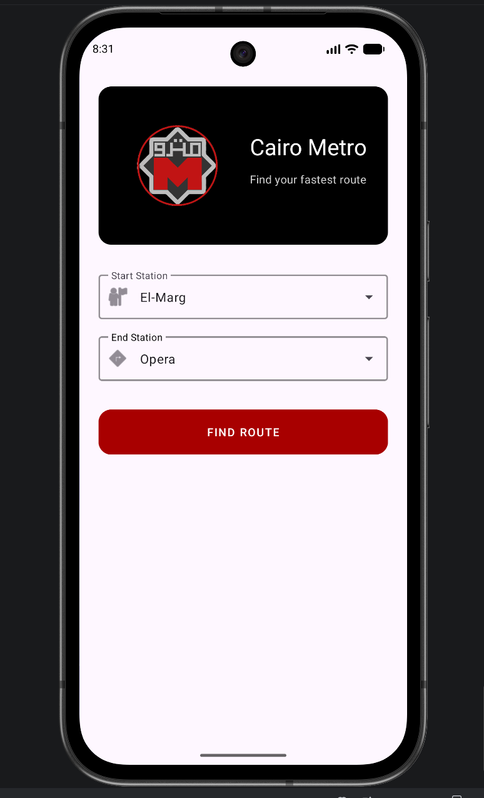
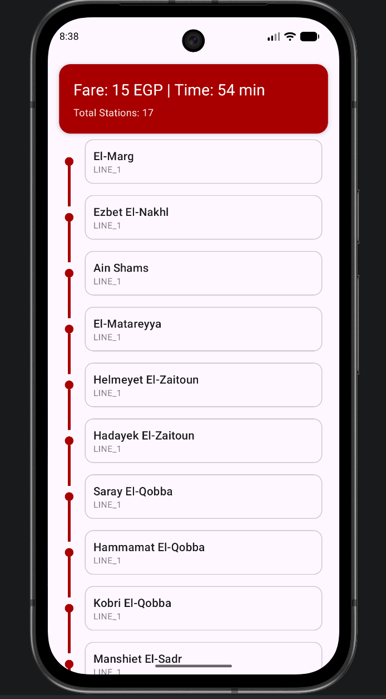

# 🚇 Egyptian Metro Application

A simple Android application that helps users navigate the **Egyptian Metro system** by selecting a start station and destination station, then calculating the route details and ticket price.

## 📱 Features

- Select **Start Station** and **Destination Station**
- Calculate **number of stations**
- Display **ticket price**
- Show **route details**
- Simple and user-friendly UI

## 🛠️ Built With

- **Kotlin**
- **Android Studio**
- **Material UI Components**

## 🎯 Purpose of the Project

The goal of this project is to simplify daily commuting for users of the **Egyptian Metro** by providing an easy way to estimate trip details such as station count and ticket price.

It was also built as a practice project to improve my skills in **Android development and Kotlin programming**.

## 📷 App Screenshots





## 🚀 Getting Started

1. Clone the repository

```bash
git clone https://github.com/Ahmuudz/Egyptian-Metro-Application.git
```

2. Open the project in **Android Studio**

3. Sync Gradle and run the application on an emulator or physical device.

## 📂 Project Structure

```
Egyptian-Metro-Application
│
├── app
├── java
├── res
│   ├── layout
│   ├── drawable
│   └── values
└── AndroidManifest.xml
```

## 🤝 Contributing

Contributions, suggestions, and feedback are welcome.

If you’d like to improve this project, feel free to fork the repository and submit a pull request.

## 👨‍💻 Author

**Ahmed Sayed**

- GitHub: https://github.com/Ahmuudz
- LinkedIn: *(www.linkedin.com/in/ahmed-sayed-hammad)*

---

⭐ If you like this project, consider giving it a star on GitHub!
